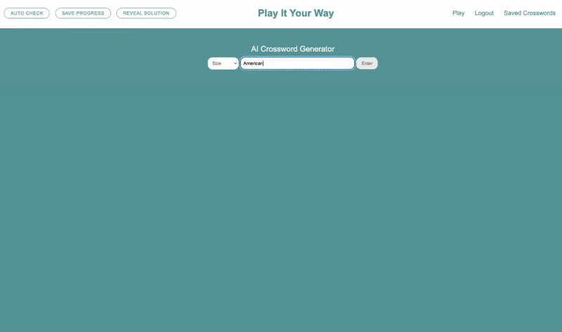

# 🧩 AI Crossword Generator
## **Overview:** an AI-powered crossword generator that builds an interactive crossword puzzle from the users category.
---
### **Highlights**:
1. Use of **Gemini Structured Outputs** to ensure consistent and accurate JSON respsonses
2. Custom **constraint based algorithms** for crossword letter placements
3. Interactive UI with live input checking

---

## 🎥 Demo:



---


---

## Instructions to Run the Crossword App Locally
1. **Clone the repo:**
    ```bash 
    git clone https://github.com/juliagrove/ai-crossword-generator.git
    ```

2. **Set up your Environment**
   - Create and activate the conda env: 

   ```bash
   cd ai-crossword-generator

   conda env create -f environment.yml
   
   conda activate ai_crossword_env
   ```
3. **Obtain a Gemini API key**
   - Create a `.env` file in the root directory and add: `GEMINI_API_KEY = "YOUR-API-KEY"`

4. **Run the App**
   ```bash 
    python manage.py runserver
    ```

5. **Navigate to Local Host**
   - Open a browser and navigate to http://127.0.0.1:8000/crossword/

---

## Tech Stack
- **Backend:** Django (Python)
- **AI:** Google Gemini LLM
- **Frontend:** JavaScript, HTML/CSS
