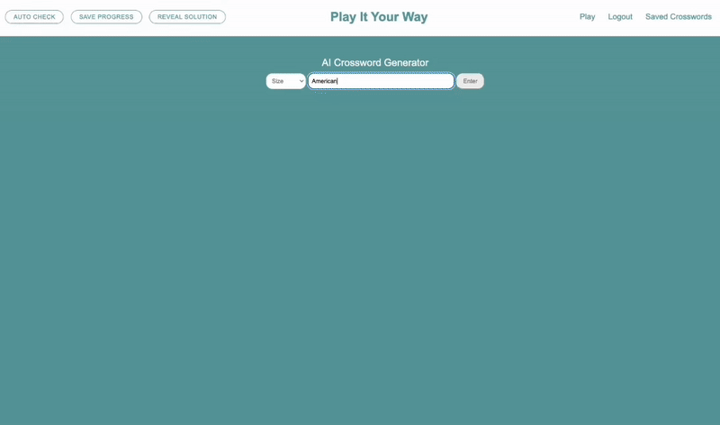

# 🧩 **AI Crossword Generator**
# **Deployed at:**  https://ai-crossword-generator.onrender.com

## **Overview:** an AI-powered crossword generator that builds an interactive crossword puzzle from the users category.
---
## **How it works**
1. User provides a category
2. Crossword words and clues are generated via **LangChain structured outputs** with a **Pydantic schema** for reliable JSON responses
3. A custom **constraint based algorithm** individually places words, starting with the longest word
4. UI renders an interactive crossword puzzle, with live input checking
5. User accounts and database persistence allow players to create accounts and save puzzles
---
## **Tech Stack**
- **Backend:** Django (Python)
- **Database:** PostgreSQL
- **AI:** LangChain framework - Currently Using Gemini LLM
- **Frontend:** JavaScript, HTML/CSS (via Django templates)
---
## **Demo**

